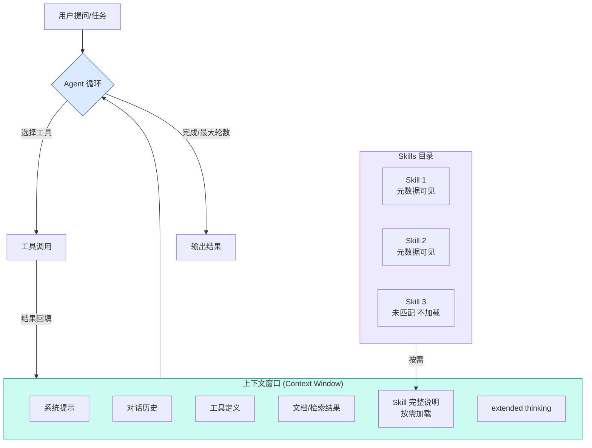

# 三个概念之间的关系：Agent · 大模型的上下文 · Skill

> 本文配合 [`learning-materials/agent.html`](./learning-materials/agent.html)、[`learning-materials/llm-context.html`](./learning-materials/llm-context.html)、[`learning-materials/skill.html`](./learning-materials/skill.html) 三份资料使用。  
> 资料来源全部可在对应 HTML 的"可核查的资料来源"小节找到。  
> 最后更新：2026-09-10

## 1. 一句话总览

| 概念 | 在 AI 系统中扮演什么 | 类比 |
|------|----------------------|------|
| **大模型的上下文**（Context Window） | LLM 单次请求的"工作记忆"，决定 AI 能"看见"多少 | 一个人每次开会能听到的总信息量 |
| **Agent** | 让 LLM 自主规划、调用工具、循环执行直到完成任务的系统 | 一个被授权自己做决策的"代理人" |
| **Skill** | 把"如何完成某类任务"打包成按需加载的资源 | 一份份放在桌上的"入职手册" |

三者不是并列的——它们是**嵌套关系**：Skill 在需要时被加载到 Context 里，Agent 用 Context 里的 Skill 来完成任务。

## 2. 三者的关系（文字描述）

### 2.1 上下文 ⊂ Agent：Agent 的能力边界由上下文决定

一个 Agent 能不能完成一个任务，**取决于它的上下文窗口能不能装下完成任务所需的所有东西**：

- 装得下系统提示、用户指令、工具定义、过往对话、文档、工具结果——Agent 才能"看到"一切。
- 装不下——Agent 要么遗忘早期信息，要么需要外部压缩/检索策略。
- 即使装得下，**不是装得多就做得好**——Anthropic 称为 "context rot"：窗口越大，模型对任意单条信息的注意力越分散。

> 因此设计 Agent 的人，做的不只是"让 LLM 决定下一步"，更重要的是"**往上下文里放什么、按什么顺序放**"。

### 2.2 Skill → Context：Skill 是"挑出来放进上下文的知识"

Skill 的核心设计叫**渐进式披露（Progressive Disclosure）**：

1. 默认只让 AI 看到每个 Skill 的 `name` 和 `description`（元数据，约 1 行 YAML）。
2. 当任务匹配某个 Skill 的描述时，AI 才加载该 Skill 的完整 `SKILL.md` 正文。
3. 真正用到该 Skill 引用的脚本/模板时，才继续加载那些文件。

效果：装了 100 个 Skill，**单次请求的 token 成本主要取决于"用到了几个"**。这正好绕开了 context window 的限制——Skill 不是"全部塞进上下文"，而是"按需拉取"。

### 2.3 Context → Agent：上下文管理是 Agent 工程的核心难题

Agent 跟普通 LLM 调用最大的区别是"循环"：一次任务可能要 5–50 轮工具调用，每轮都会：
- 增加新的对话历史
- 引入工具结果（可能是大文档、表格、图片）
- 消耗输出 token（包括 extended thinking）

每一轮结束，下一轮的 context window 都会增长。Anthropic 的官方建议是：**长文档放顶部，查询放最后**；用 XML 标签结构化；先让模型引用原文再执行任务。这都是为了在有限的 context window 里让 Agent 跑得更稳。

## 3. 三者的关系（Mermaid 图）

## 4. 三者如何一起工作：一个具体例子

假设你让 Claude Agent "帮我看看这份财报里 2025 年的净利润"：

| 步骤 | 涉及的概念 | 发生了什么 |
|------|-----------|----------|
| 1 | Context | 你的提问进入上下文窗口 |
| 2 | Skill | AI 在 Skills 目录里扫一遍，发现有个 "financial-report" Skill 描述匹配，加载它的 SKILL.md |
| 3 | Skill | 该 Skill 引导 AI："先定位'净利润'这一行、提取数字、对比去年同期" |
| 4 | Context | 财报 PDF 被放进上下文（可能占几万个 token） |
| 5 | Context | 按 Anthropic 建议，PDF 放顶部、查询放最后 |
| 6 | Agent | AI 决定调用 `extract_numbers` 工具 |
| 7 | Context | 工具结果回填到上下文，可能触发 extended thinking |
| 8 | Agent | AI 自我评估"任务完成了吗？"——是，输出答案 |
| 9 | Context | 整个对话历史保留到上下文窗口里 |

如果这是一个长任务多轮循环，第 2–8 步会重复执行，每次都在消耗 context window；到了窗口快满的时候，Anthropic 推荐做"服务端压缩（server-side compaction）"——把早期对话历史摘要后塞回去，腾出空间。

## 5. 对比表：把容易混的地方一次说清

| 维度 | 上下文 (Context) | Agent | Skill |
|------|------------------|-------|-------|
| 是什么 | LLM 单次请求的工作记忆容量 | LLM + 工具 + 自主决策循环 | 按需加载的结构化任务知识 |
| 谁在管理 | 平台 / API 自动 | 开发者 + LLM | 开发者 / 团队 |
| 主要成本 | 输入 token × 单价 | 延迟 + 多轮 token + 工具调用开销 | 元数据开销极低、匹配后 1×SKILL.md token |
| 失效模式 | context rot（信息多反而注意力散） | 累积错误、循环不退出、成本失控 | 描述写得不清楚 → AI 不调用 / 调用错 |
| 优化方向 | 摘要、压缩、检索 | 简单优先（能用规则就别上 Agent） | 描述要具体 + 给示例 + 边界要写清 |

## 6. 我的判断（个人理解）

1. **Agent 是当下 AI 应用的主战场**，但 90% 的"Agent 难用"问题其实不是 Agent 本身不行，而是**上下文管理**没做好。  
2. **Skill 是把"上下文管理"规模化的最佳工具**——它让团队/个人能把"做过一次的工作"沉淀下来，下次复用，不用每次重新 prompt。  
3. **三者关系是"Skill 装知识、Context 限边界、Agent 做决策"**：Skill 提供弹药，Context 决定能装多少弹药，Agent 决定先打哪一发。

如果一句话总结：**"用 Skill 把专家知识按需装进 Context，让 Agent 在边界内自主决策。"**

## 7. 进一步阅读

- 三个概念的详细资料：[`learning-materials/`](./learning-materials/)
- 本仓库的项目级 Skill：[`.workbuddy/skills/concept-learner/SKILL.md`](./.workbuddy/skills/concept-learner/SKILL.md)
- 资料来源全部以原始 URL 形式列在每份 HTML 的第 6 节